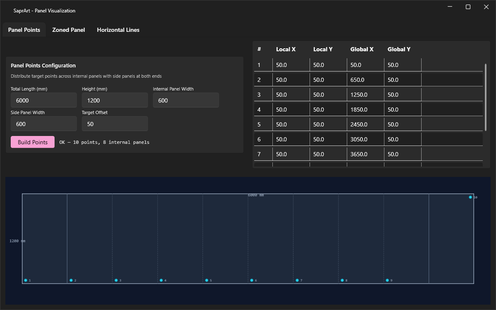
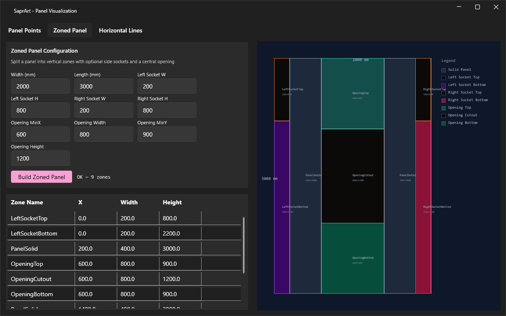
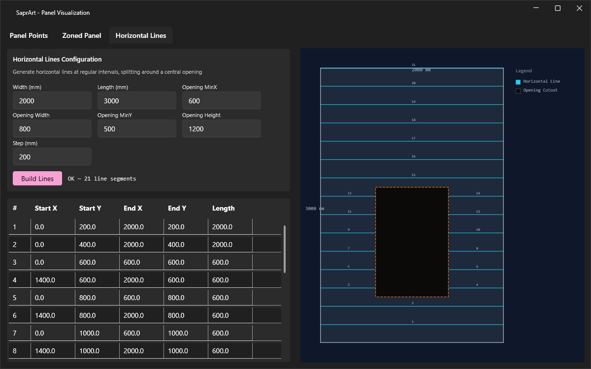

# SaprArt

## Задачи

### 1. Точки панелей

Для составной панели из двух боковых и N равноразмерных внутренних панелей рассчитывается позиция целевой/сверлильной точки каждой панели со смещением от угла на заданное расстояние.

> **Процессор:** [`PanelPointsCalculator`](Core/Processors/PanelPointsCalculator.cs)

### 2. Зонированная панель

Декомпозиция панели с опциональными пазами слева/справа и центральным вырезом именованные вертикальные зоны (сплошная, паз верх/низ, вырез верх/вырез/низ).

> **Процессор:** [`ZoneSplitter`](Core/Processors/ZoneSplitter.cs)

### 3. Горизонтальные линии

Генерация горизонтальных линий через равные промежутки по панели. Линии, проходящие через вырез, автоматически разделяются на левый и правый сегменты.

> **Процессор:** [`HorizontalLinesStepCalculator`](Core/Processors/HorizontalLinesStepCalculator.cs)

## Архитектура

- **Core** — доменная модель, процессоры и валидаторы (net10.0)
- **Presentation** — WPF MVVM UI с Fluent-темой WPF-UI (net10.0-windows)
- **Core.UnitTests** — xUnit-тесты для всех процессоров и валидаторов
